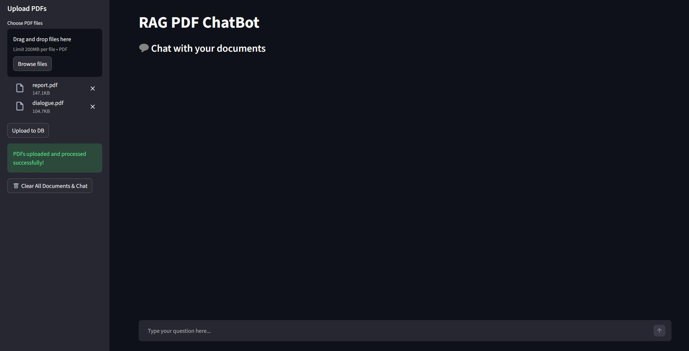
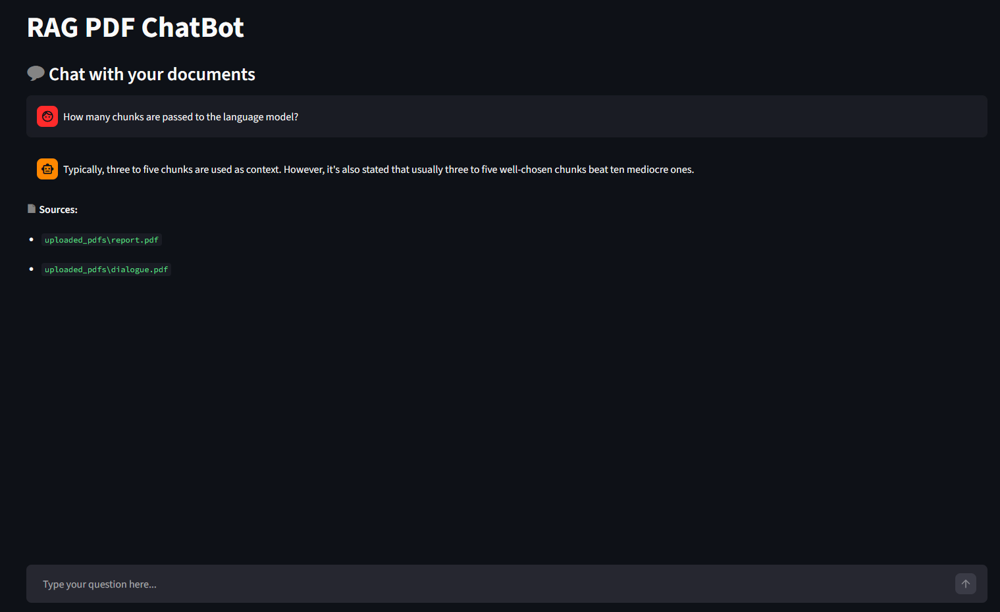
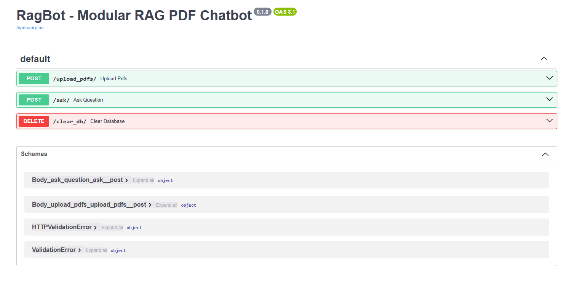

# 🤖 RagBot - Modular RAG PDF Chatbot

> Upload any PDF. Ask anything. Get answers grounded in your documents.

A production-style **Retrieval-Augmented Generation (RAG)** application built with a fully decoupled **FastAPI backend** and **Streamlit frontend**. Upload PDF documents, embed their content into a local **ChromaDB** vector store, and chat with an AI assistant powered by **Groq's LLaMA3** - all in real time.

---

## 📸 Screenshots

**Streamlit UI — Chat in Action**


**Streamlit UI — Upload Screen**


**FastAPI Swagger Docs**


**Postman — `/ask/`**


**Postman — `/upload_pdfs/`**


**Postman — `/clear_db/`**


---

## ✨ Features

| Feature | Description |
|---|---|
| 📄 PDF Upload | Upload one or more PDFs via the Streamlit UI |
| 🧠 Smart Chunking | Documents are split into chunks and embedded using HuggingFace models |
| 🗃️ Vector Storage | Embeddings are stored and retrieved from a local ChromaDB instance |
| 💬 Contextual Chat | Queries are answered by LLaMA3 via Groq using only retrieved context |
| 🔄 Chat History | Conversation history is maintained within a session |
| 📥 History Download | Export your chat history directly from the UI |
| 🗑️ Clear DB | Wipe all uploaded PDFs and vector data with one API call |
| 🌐 Microservice Architecture | Decoupled client and server — independently runnable and scalable |

---

## 🧠 How RAG Works

```
User Query
    │
    ▼
Query Embedding  ──►  ChromaDB Vector Search  ──►  Top-K Relevant Chunks
                                                            │
                                                            ▼
                                              LLaMA3 (via Groq API)
                                              + Retrieved Context
                                                            │
                                                            ▼
                                                  Grounded AI Response
```

**Retrieval-Augmented Generation (RAG)** prevents hallucination by injecting real document content into the LLM's context before it answers. The model only responds based on what's in your PDFs — not its pre-trained assumptions.

---

## 🗂️ Project Structure

```
RagBot-PDF-CHATBOT/
├── client/                     # 🖥️ Streamlit Frontend
│   ├── components/
│   │   ├── chatUI.py           # Chat interface component
│   │   ├── history_download.py # Export chat history
│   │   └── upload.py           # PDF upload component
│   ├── utils/
│   │   └── api.py              # API call helpers
│   ├── app.py                  # Main Streamlit app entry point
│   └── config.py               # Client-side configuration
│
├── server/                     # ⚙️ FastAPI Backend
│   ├── modules/
│   │   ├── llm.py              # Groq LLaMA3 LLM integration
│   │   ├── load_vectorstore.py # ChromaDB vectorstore loader
│   │   ├── pdf_handlers.py     # PDF parsing & chunking
│   │   └── query_handlers.py   # RAG query pipeline
│   ├── chroma_store/           # ← Created at runtime (vector DB)
│   ├── uploaded_pdfs/          # ← Created at runtime (raw PDFs)
│   ├── logger.py               # Logging configuration
│   └── main.py                 # FastAPI app entry point
│
├── sample_pdfs/                # Sample PDFs for testing
├── requirements.txt            # Python dependencies
└── README.md
```

---

## 🚀 Getting Started

### Prerequisites

- Python 3.9+
- A free [Groq API Key](https://console.groq.com/)

---

### 1. Clone the Repository

```bash
git clone https://github.com/HamadRizwan007/RagBot---Modular-RAG-PDF-Chatbot.git
cd RagBot-2.0
```

---

### 2. Setup & Run the Backend (FastAPI)

```bash
cd server

# Create and activate virtual environment
python -m venv venv
source venv/bin/activate        # Windows: venv\Scripts\activate

# Install dependencies
pip install -r requirements.txt

# Create a .env file and add your Groq API key
echo 'GROQ_API_KEY="your_key_here"' > .env

# Start the FastAPI server
uvicorn main:app --reload
```

The server will start at: `http://127.0.0.1:8000`  
Interactive API docs: `http://127.0.0.1:8000/docs`

---

### 3. Setup & Run the Frontend (Streamlit)

Open a **new terminal** and run:

```bash
cd client

# (Optional) activate a separate venv or reuse the same one
pip install -r requirements.txt

# Launch the Streamlit app
streamlit run app.py
```

The app will open at: `http://localhost:8501`

---

## 🌐 API Endpoints

| Method | Endpoint | Description |
|---|---|---|
| `POST` | `/upload_pdfs/` | Upload PDF files and build the vectorstore |
| `POST` | `/ask/` | Send a query and receive a grounded answer |
| `DELETE` | `/clear_db/` | Clear all uploaded files and ChromaDB data |

> 📬 Test via **Postman** or the built-in Swagger UI at `/docs`.

### Example: Ask a Question

```bash
curl -X POST "http://127.0.0.1:8000/ask/" \
  -H "Content-Type: application/json" \
  -d '{"query": "What is the main topic of the uploaded document?"}'
```

---

## 🛠️ Tech Stack

| Layer | Technology |
|---|---|
| LLM | [LLaMA3 via Groq](https://console.groq.com/) |
| Embeddings | [HuggingFace Sentence Transformers](https://huggingface.co/) |
| Vector Store | [ChromaDB](https://www.trychroma.com/) |
| RAG Framework | [LangChain](https://www.langchain.com/) |
| Backend | [FastAPI](https://fastapi.tiangolo.com/) |
| Frontend | [Streamlit](https://streamlit.io/) |

---

## ⚙️ Environment Variables

Create a `.env` file inside the `server/` directory:

```env
GROQ_API_KEY="your_groq_api_key_here"
```

---

## 🙌 Credits

- [LangChain](https://www.langchain.com/) — RAG pipeline orchestration
- [ChromaDB](https://www.trychroma.com/) — Local vector store
- [Groq](https://groq.com/) — Fast LLM inference
- [Streamlit](https://streamlit.io/) — Frontend UI
- [FastAPI](https://fastapi.tiangolo.com/) — Backend API framework

---

## 📄 License

This project is open source and available under the [MIT License](LICENSE).
